# **MONEO** 

This repository is the Capstone Project in Bangkit Academy 2023 Batch 2. This application is purpose to help user to Money Management.<br>

## Instructions
1. Clone the repository by running the following command in your terminal or Git Bash:
  ```bash
  git clone https://github.com/CH2-PS188/MD.git
  ```
2. Open Android Studio and click on "Open an existing Android Studio project". Navigate to the directory where you cloned the repository and select the "Moneo" folder.
3. Wait for the Gradle build to finish. This may take a few minutes.
4. Connect an Android device to your computer or start an emulator.
5. In Android Studio, click on the "Run" button (the green triangle) in the toolbar. Select the device you want to run the app on and click "OK".
6. Wait for the app to be installed and launched on your device. You should now be able to use the EcoSense app!

If you encounter any errors or issues, you can refer to the "Issues" section of the repository or contact the repository's maintainer for help.

# Application Install

***You can Install and test latest Moneo app from below 👇***

[](https://drive.google.com/file/d/1moIHLpwPgLpan743xo-F6Pv7h1aGih_F/view?usp=sharing)


## Getting started
- Prerequisites
  - Android
  - Internet connection

- Installation
  - Download the APK
  - Install the APK

## 📸 Screenshots
||||
|:----------------------------------------:|:-----------------------------------------:|:-----------------------------------------: |
| 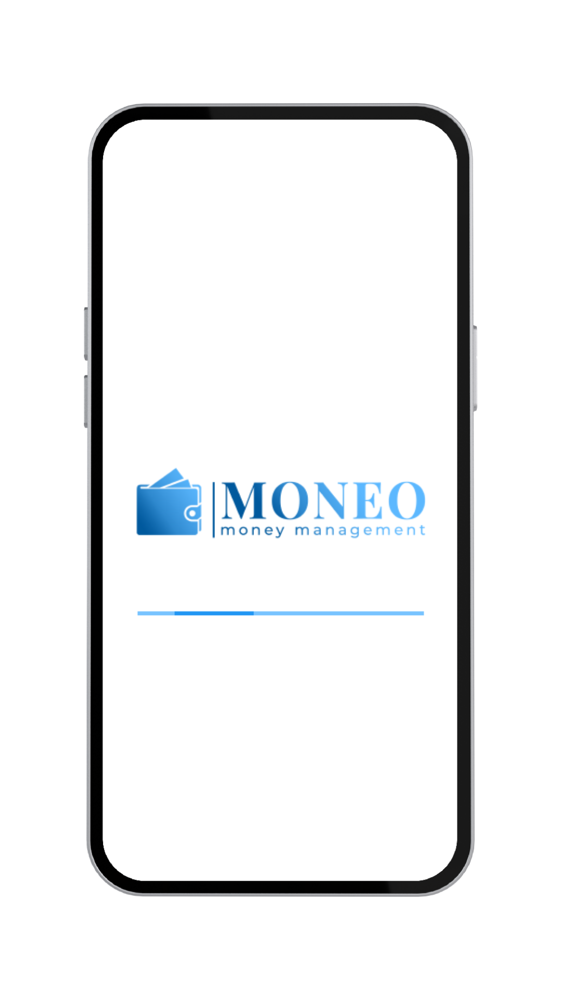 | 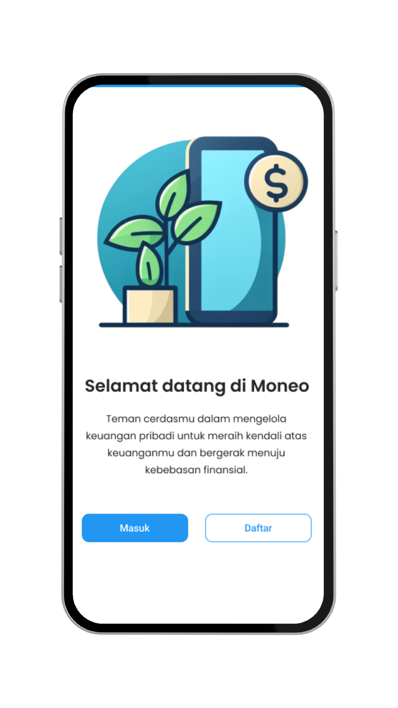 | 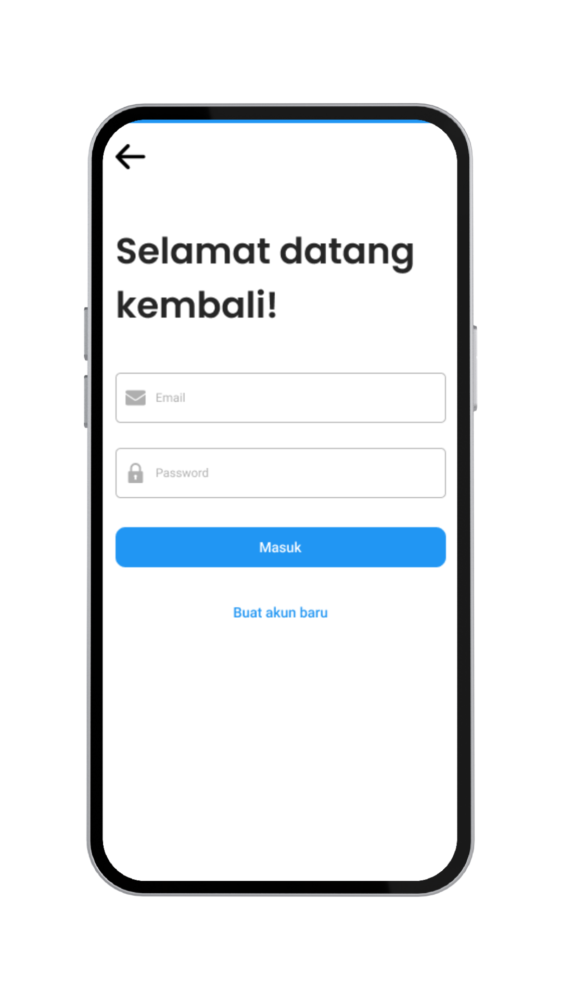 | 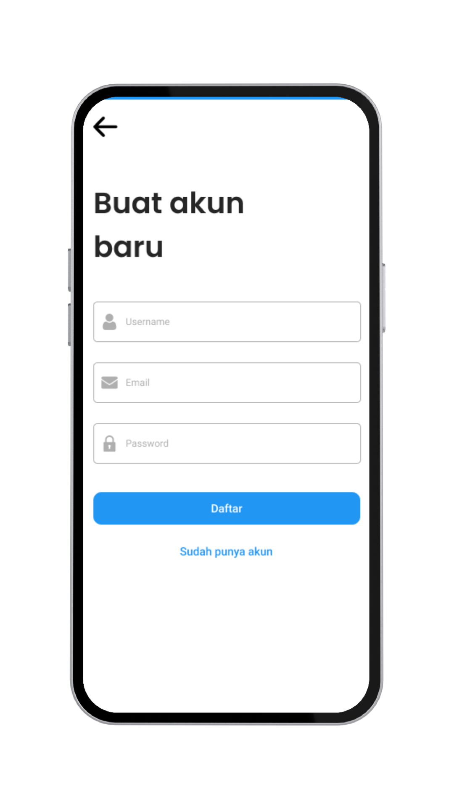 |
| 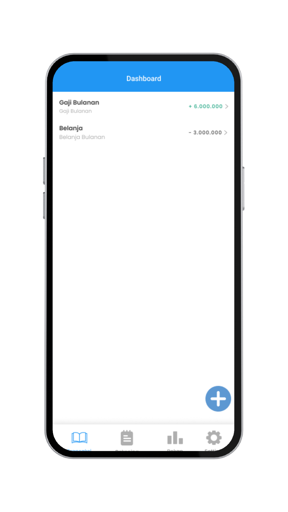 |  | 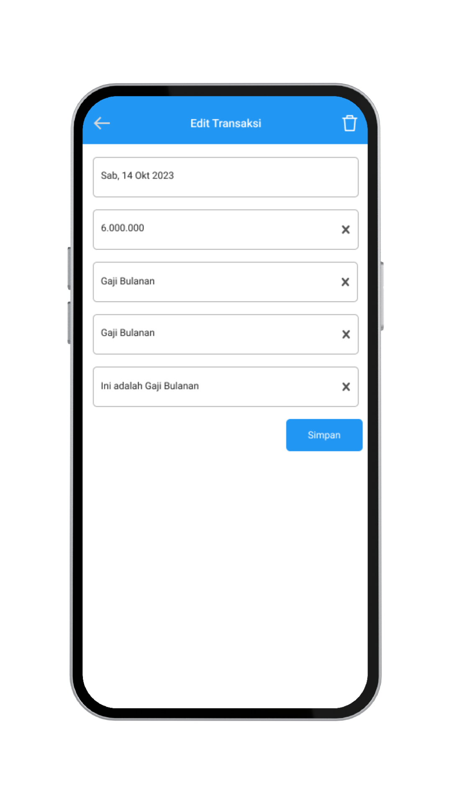 | 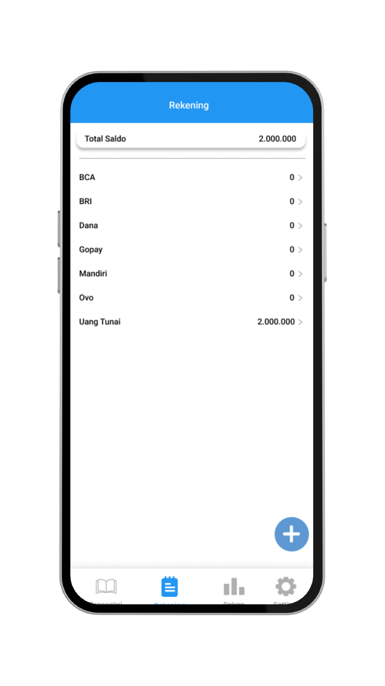 |
|  | 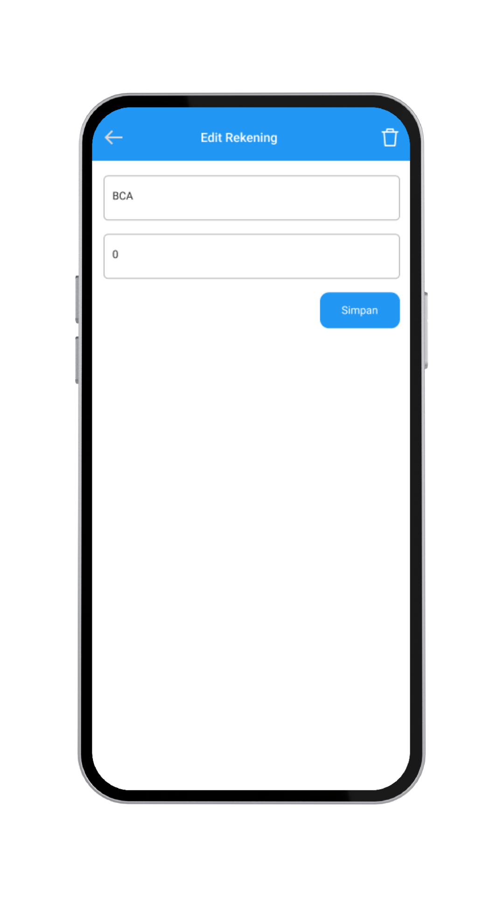 | 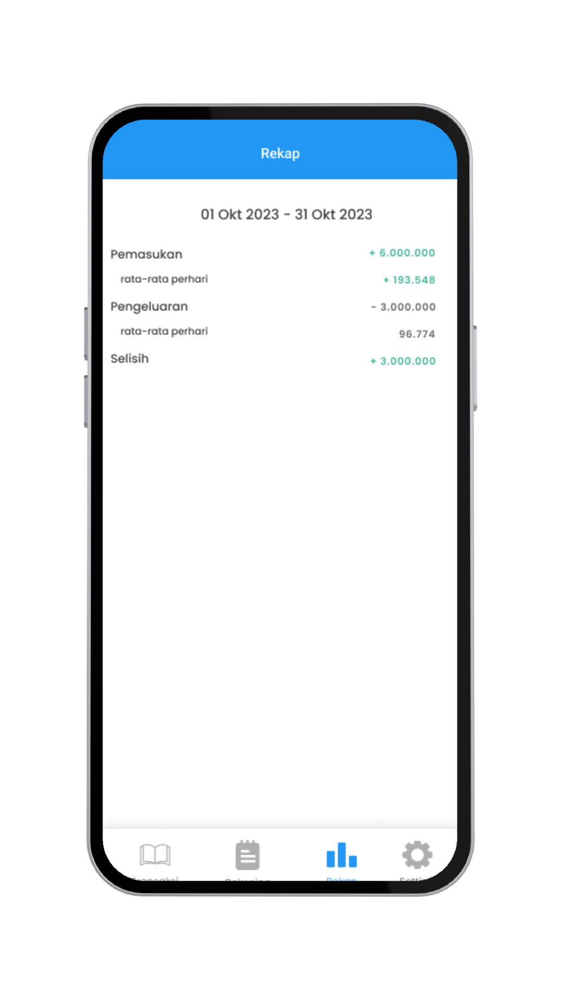 | 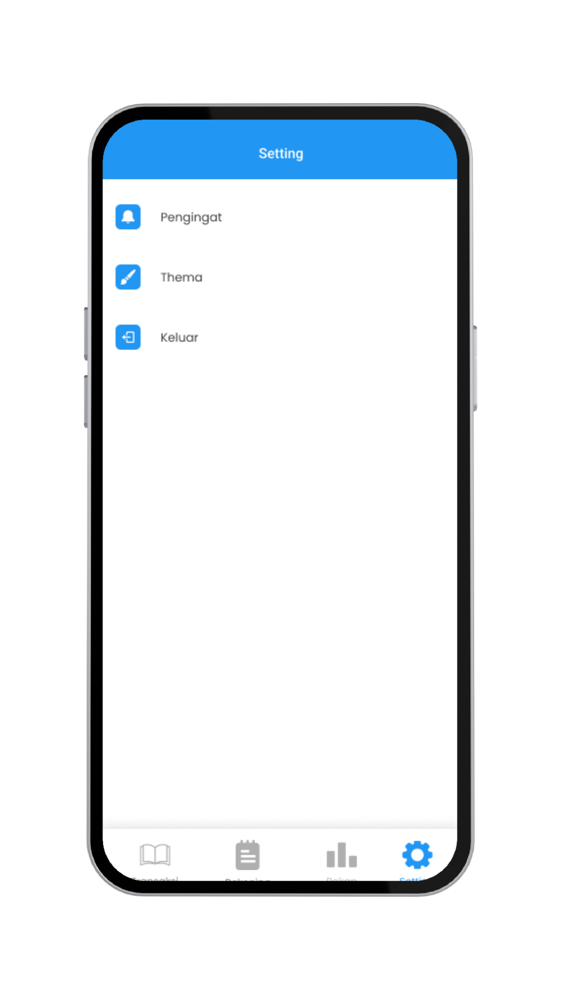 |
| 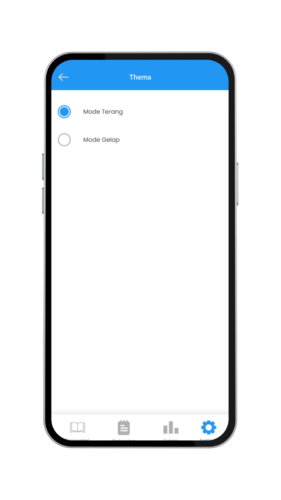 | 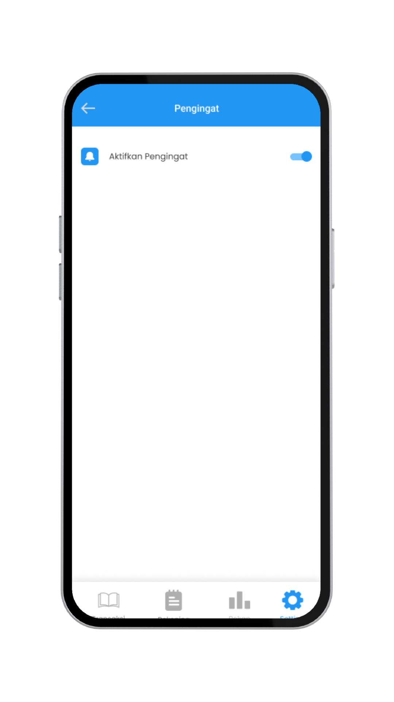 | 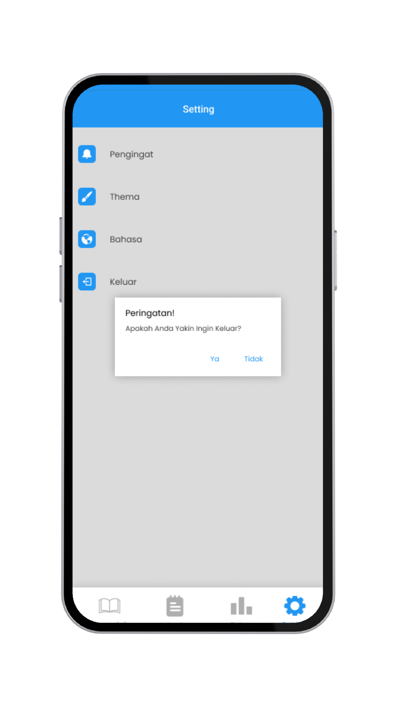 | 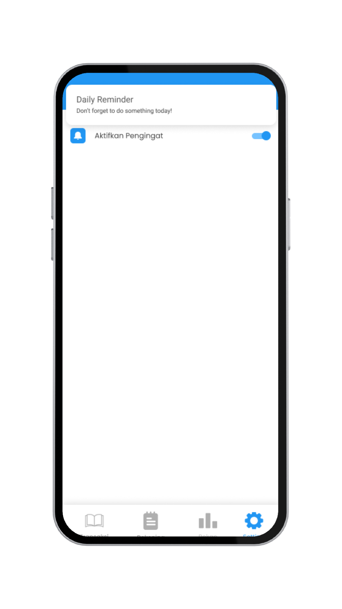 |

## About
- Login and Registrations
- Add and Edit Transactions
- Add and Edit Account
- Final Report
- Daily Reminder
- Light Mode and Dark Mode 🌗


## Architecture
This app uses [***MVVM (Model View View-Model)***](https://developer.android.com/jetpack/docs/guide#recommended-app-arch) architecture.


